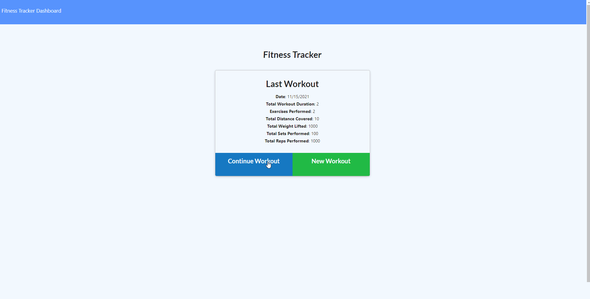

# Fitness Tracker

## Table of Contents
* [Description](#description)
* [Usage Information](#usage-information)
* [License](#license)
* [Contributors](#contributors)
* [Questions](#questions)

## Description
A full stack web application for tracking your fitness goals. Create new workouts and add your exercises for each workout to track the duration, weight lifted, or distance travelled during your workout.

## Usage Information
Click add new workout to start a new workout. Then, add exercises until your workout is complete by filling out the requisite information and pressing "add workout" When you're done with your workout, hit complete instead of add exercise on your final exercise. Check your workout statistics on the dashboard.

## See the live site [here](https://dry-springs-66302.herokuapp.com/)




## License


      The person who associated a work with this deed has dedicated the work to the public domain by waiving all of his or her rights to the work worldwide under copyright law, including all related and neighboring rights, to the extent allowed by law.

      You can copy, modify, distribute and perform the work, even for commercial purposes, all without asking permission.

Read more: [Link to license](http://creativecommons.org/publicdomain/zero/1.0/)

## Contributors

**Adam Kruschwitz**
* [GitHub](https://github.com/AdamKruschwitz)
* [LinkedIn](https://linkedin.com/li/adamkruschwitz)
## Questions
reach out to me at ```a.j.kruschwitz@gmail.com``` and I'll get back to you as soon as I can